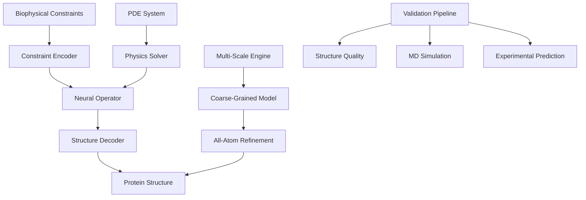

# Zero-Shot Protein-Operators Architecture

## System Overview

Zero-Shot Protein-Operators implements a neural operator-based framework for de novo protein design using PDE-constrained optimization. The system transforms biophysical constraints into protein structures through learned mappings without requiring explicit training examples for each design task.

## High-Level Architecture



## Core Components

### 1. Neural Operator Framework

#### DeepONet Architecture
- **Branch Network**: Encodes constraint functions into finite-dimensional representation
- **Trunk Network**: Encodes spatial coordinates and geometric features
- **Operator Core**: Learns mappings from constraint space to structure space
- **Output Decoder**: Transforms operator output to 3D coordinates

#### Fourier Neural Operator (FNO)
- **Spectral Convolutions**: Frequency domain operations for global receptive fields
- **Skip Connections**: Preserve local features across scales
- **Multi-Resolution**: Hierarchical representation from coarse to fine details
- **Periodic Boundaries**: Handle protein symmetries and periodicity

### 2. Constraint Processing System

#### Constraint Types
- **Structural**: Secondary structure, fold topology, disulfide bonds
- **Functional**: Binding sites, catalytic activity, allosteric sites
- **Biophysical**: Stability, solubility, aggregation propensity
- **Geometric**: Shape complementarity, surface properties

#### Constraint Encoding Pipeline
```
Raw Constraints → Vectorization → Normalization → Embedding → Neural Operator
```

### 3. PDE-Based Physics Engine

#### Folding Dynamics PDE
```
∂u/∂t = -∇E(u) + η(t)
```
Where:
- `u`: Protein conformation field
- `E`: Energy functional (force field + constraints)
- `η`: Thermal noise term

#### Energy Functionals
- **Bonded Terms**: Bond lengths, angles, dihedrals
- **Non-bonded**: Electrostatics, van der Waals, hydrogen bonds
- **Solvation**: Implicit/explicit solvent models
- **Constraints**: Penalty terms for design objectives

### 4. Multi-Scale Modeling Pipeline

#### Scale Hierarchy
1. **Coarse-Grained (CG)**: Martini/SIRAH force fields
2. **United-Atom**: Reduced atomic representation
3. **All-Atom**: Full atomic detail with explicit hydrogens
4. **Electronic**: QM/MM for catalytic sites

#### Scale-Bridging Neural Operators
- **Upsampling Operators**: CG → All-Atom structure refinement
- **Downsampling Operators**: All-Atom → CG for efficient sampling
- **Cross-Scale Consistency**: Energy conservation across scales

## Data Flow Architecture

### Training Pipeline
```
PDB Database → MD Simulations → Trajectory Processing → Feature Extraction → Neural Operator Training
```

### Design Pipeline
```
User Constraints → Constraint Processing → Neural Operator → Structure Generation → Validation → Output
```

### Validation Pipeline
```
Generated Structure → Stereochemistry Check → Physics Validation → MD Simulation → Experimental Prediction
```

## Component Interactions

### Neural Operator Core
- **Input**: Constraint embeddings + spatial coordinates
- **Processing**: Spectral convolutions + nonlinear transformations
- **Output**: 3D coordinates + confidence scores

### Physics Integrator
- **Input**: Neural operator predictions + physics constraints
- **Processing**: PDE solving + energy minimization
- **Output**: Physics-consistent structures

### Multi-Scale Coordinator
- **Input**: Target resolution + computational budget
- **Processing**: Adaptive scale selection + refinement
- **Output**: Optimally resolved structures

## Design Patterns

### Observer Pattern
- **Structure Validators**: Monitor generation quality
- **Physics Checkers**: Ensure energy consistency
- **Constraint Monitors**: Track objective satisfaction

### Strategy Pattern
- **Operator Selection**: DeepONet vs FNO based on problem
- **Solver Strategy**: Direct vs iterative PDE solving
- **Refinement Strategy**: Adaptive vs fixed multi-scale

### Factory Pattern
- **Constraint Factory**: Create constraint objects from specifications
- **Operator Factory**: Instantiate neural operators with configurations
- **Validator Factory**: Generate validation pipelines

## Performance Architecture

### Computational Graph
- **GPU Parallelization**: Batch processing of multiple designs
- **Memory Optimization**: Gradient checkpointing for large operators
- **Distributed Training**: Multi-GPU operator training

### Caching Strategy
- **Operator Weights**: Pre-trained model checkpoints
- **Constraint Embeddings**: Reusable constraint representations
- **Validation Results**: Cached structure quality metrics

### Scalability Considerations
- **Horizontal Scaling**: Distributed inference across clusters
- **Vertical Scaling**: GPU memory optimization for large proteins
- **Load Balancing**: Adaptive task distribution

## Security Architecture

### Input Validation
- **Constraint Sanitization**: Prevent malicious constraint injection
- **Structure Validation**: Verify biological plausibility
- **Resource Limits**: Prevent computational DoS attacks

### Model Security
- **Weight Verification**: Cryptographic validation of model integrity
- **Inference Isolation**: Sandboxed execution environments
- **Audit Logging**: Track all design operations

## Extensibility Architecture

### Plugin System
- **Constraint Plugins**: Custom constraint types
- **Operator Plugins**: Novel neural architectures
- **Validator Plugins**: Domain-specific validation rules

### API Architecture
- **REST API**: HTTP-based design requests
- **GraphQL**: Flexible query interface
- **WebSocket**: Real-time design monitoring

### Integration Points
- **Molecular Dynamics**: OpenMM, GROMACS, NAMD
- **Structure Analysis**: PyMOL, ChimeraX, VMD
- **Machine Learning**: PyTorch, JAX, TensorFlow

## Quality Assurance Architecture

### Testing Strategy
- **Unit Tests**: Individual component validation
- **Integration Tests**: End-to-end pipeline testing
- **Physics Tests**: Energy conservation verification
- **Regression Tests**: Design quality benchmarks

### Monitoring System
- **Performance Metrics**: Inference speed, memory usage
- **Quality Metrics**: Structure validation scores
- **Physics Metrics**: Energy consistency checks
- **User Metrics**: Design success rates

## Deployment Architecture

### Container Strategy
- **Base Images**: CUDA-enabled PyTorch containers
- **Multi-Stage Builds**: Optimized production images
- **Layer Caching**: Efficient image updates

### Orchestration
- **Kubernetes**: Container orchestration and scaling
- **Service Mesh**: Inter-service communication
- **Load Balancing**: Request distribution

### Storage Architecture
- **Model Storage**: Distributed model repository
- **Data Storage**: High-performance file systems
- **Cache Storage**: Redis for fast access

## Future Architecture Evolution

### Planned Enhancements
- **Quantum Computing**: Hybrid classical-quantum operators
- **Foundation Models**: Large-scale pre-trained protein operators
- **Active Learning**: Iterative design-synthesis-test loops
- **Multi-Modal**: Integration with experimental data streams

### Architectural Debt
- **Legacy Components**: Gradual migration strategy
- **Performance Bottlenecks**: Identified optimization targets
- **Scalability Limits**: Growth planning and mitigation