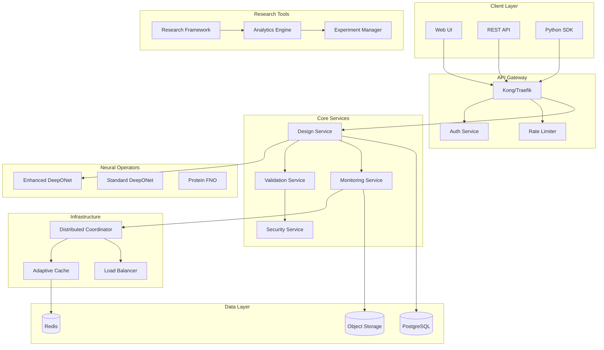
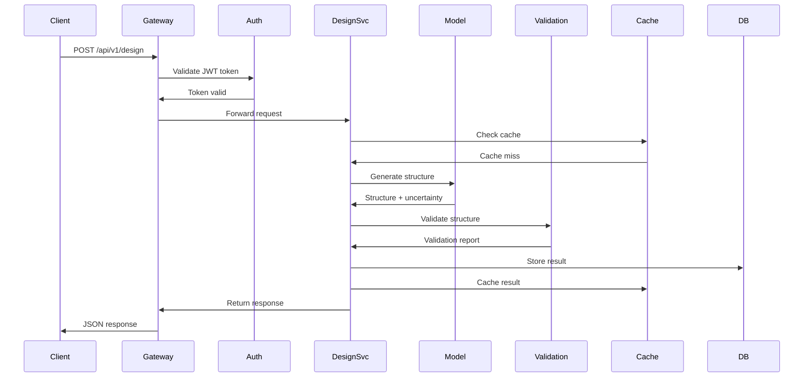
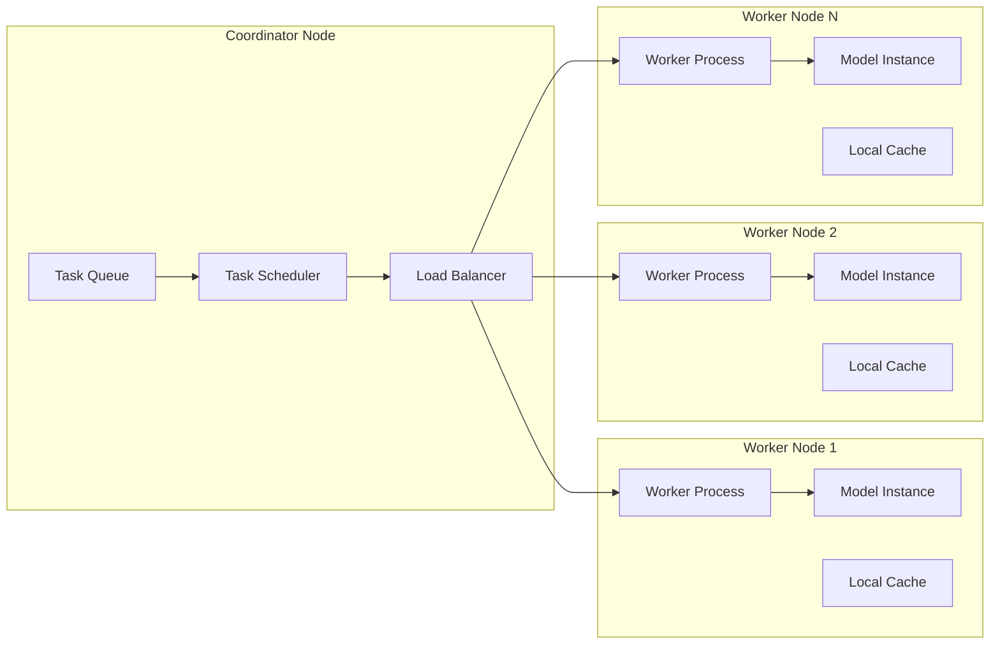
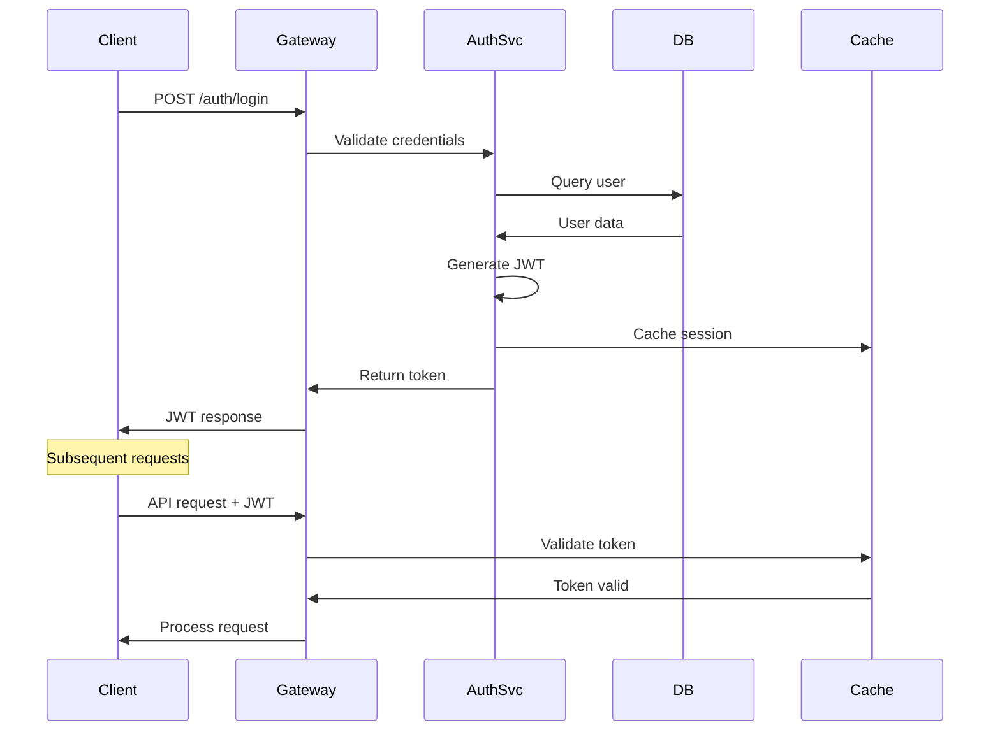
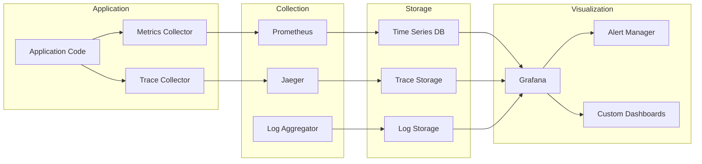

# 🏗️ System Architecture Guide

## 🔍 Overview

The Enhanced Protein Operators system implements a sophisticated, scalable architecture for neural operator-based protein design. The system follows microservices patterns with distributed computing capabilities, advanced monitoring, and production-ready security.

## 🎯 Architectural Principles

### 1. Separation of Concerns
- **Models**: Neural operator implementations
- **Services**: Business logic and orchestration
- **Infrastructure**: Distributed computing and caching
- **Validation**: Quality assessment and metrics
- **Security**: Authentication, authorization, and audit

### 2. Scalability
- **Horizontal scaling** via Kubernetes deployments
- **Load balancing** with intelligent task distribution
- **Auto-scaling** based on resource utilization
- **Distributed coordination** across multiple nodes

### 3. Reliability
- **Fault tolerance** with graceful degradation
- **Health checks** and automatic recovery
- **Circuit breakers** for external dependencies
- **Comprehensive monitoring** and alerting

### 4. Security
- **Zero-trust architecture** with mutual authentication
- **Defense in depth** with multiple security layers
- **Audit logging** for compliance and forensics
- **Input validation** and sanitization

## 🧩 System Components



## 🚀 Progressive Enhancement Architecture

### Generation 1: Core Functionality (Simple)

#### Enhanced DeepONet Layer
```python
# Adaptive basis functions with dynamic complexity
class AdaptiveBasisNetwork(nn.Module):
    def __init__(self, input_dim, num_basis, adaptive_layers=3):
        # Multi-scale basis functions
        # Complexity controller
        # Adaptive branches
```

#### Design Service Layer
```python
# Multi-strategy optimization
class AdvancedDesignService:
    def __init__(self, optimization_strategies):
        # Evolutionary optimizer
        # Gradient-based optimizer
        # Simulated annealing
```

#### Validation Framework
```python
# AI-powered validation
class AdvancedValidationFramework:
    def __init__(self, enable_ai_predictor=True):
        # Geometric validator
        # Physics validator
        # AI quality predictor
```

### Generation 2: Robustness (Robust)

#### Monitoring System
```python
# Comprehensive observability
class AdvancedMonitoringSystem:
    def __init__(self, metrics_retention_days=30):
        # Performance profiler
        # Resource monitor
        # Alert manager
        # Audit logger
```

#### Security Manager
```python
# Zero-trust security
class SecurityManager:
    def __init__(self, rate_limit_requests=100):
        # Input validator
        # Access control
        # Rate limiter
        # Audit logger
```

#### Research Framework
```python
# Scientific methodology
class AdvancedResearchFramework:
    def __init__(self, enable_statistics=True):
        # Experiment designer
        # Hypothesis tester
        # Statistical analyzer
        # Report generator
```

### Generation 3: Scalability (Optimized)

#### Distributed Coordinator
```python
# Multi-node coordination
class DistributedCoordinator:
    def __init__(self, max_nodes=100):
        # Node manager
        # Task scheduler
        # Load balancer
        # Fault detector
```

#### Adaptive Cache System
```python
# Multi-level caching
class AdaptiveCacheSystem:
    def __init__(self, cache_levels=4):
        # L1: Memory cache
        # L2: Redis cache
        # L3: Database cache
        # L4: Object storage
```

## 🔄 Data Flow Architecture

### Request Processing Pipeline



### Distributed Task Processing



## 🔧 Component Interactions

### Model Layer Architecture

```python
# Base neural operator interface
class BaseNeuralOperator(nn.Module):
    def forward(self, constraints, coordinates):
        pass
    
    def encode_constraints(self, constraints):
        pass
    
    def encode_coordinates(self, coordinates):
        pass

# Enhanced implementation with advanced features
class EnhancedProteinDeepONet(BaseNeuralOperator):
    def __init__(self, adaptive_basis=True, uncertainty_quantification=True):
        # Adaptive basis networks
        # Multi-scale attention
        # Uncertainty quantifier
        # Physics-informed components
    
    def forward_with_uncertainty(self, constraints, coordinates):
        # Enhanced forward pass with uncertainty estimates
        pass
```

### Service Layer Architecture

```python
# Abstract service interface
class BaseService:
    def __init__(self, model, cache, monitor):
        self.model = model
        self.cache = cache
        self.monitor = monitor
    
    async def process_request(self, request):
        pass

# Design service implementation
class AdvancedDesignService(BaseService):
    def __init__(self, model, optimization_strategies):
        super().__init__(model, cache, monitor)
        self.optimizers = self._initialize_optimizers(optimization_strategies)
    
    async def design_protein_async(self, constraints, length):
        # Multi-strategy optimization
        # Quality assessment
        # Result caching
        pass
```

### Infrastructure Layer Architecture

```python
# Distributed coordination
class DistributedCoordinator:
    def __init__(self, cluster_config):
        self.node_manager = NodeManager()
        self.task_scheduler = TaskScheduler()
        self.load_balancer = LoadBalancer()
        self.fault_detector = FaultDetector()
    
    async def submit_task(self, task_type, task_data, priority):
        # Select optimal node
        # Schedule task execution
        # Monitor progress
        # Handle failures
        pass

# Adaptive caching system
class AdaptiveCacheSystem:
    def __init__(self, cache_hierarchy):
        self.l1_cache = MemoryCache()     # Fastest access
        self.l2_cache = RedisCache()      # Network cache
        self.l3_cache = DatabaseCache()   # Persistent cache
        self.l4_cache = ObjectStorage()   # Bulk storage
    
    async def get(self, key):
        # Try L1 -> L2 -> L3 -> L4
        # Update higher levels on hit
        # Implement cache warming
        pass
```

## 📊 Performance Architecture

### Scaling Strategies

#### Horizontal Scaling
```yaml
# Kubernetes HPA configuration
apiVersion: autoscaling/v2
kind: HorizontalPodAutoscaler
metadata:
  name: protein-operators-api-hpa
spec:
  scaleTargetRef:
    apiVersion: apps/v1
    kind: Deployment
    name: protein-operators-api
  minReplicas: 2
  maxReplicas: 10
  metrics:
  - type: Resource
    resource:
      name: cpu
      target:
        type: Utilization
        averageUtilization: 70
  - type: Resource
    resource:
      name: memory
      target:
        type: Utilization
        averageUtilization: 80
```

#### Vertical Scaling
```yaml
# Resource requests and limits
resources:
  requests:
    cpu: 1000m
    memory: 2Gi
  limits:
    cpu: 2000m
    memory: 4Gi
```

### Load Balancing Architecture

```python
class LoadBalancer:
    def __init__(self, balancing_strategy="adaptive"):
        self.strategies = {
            "round_robin": RoundRobinBalancer(),
            "least_connections": LeastConnectionsBalancer(),
            "adaptive": AdaptiveBalancer(),
            "resource_aware": ResourceAwareBalancer()
        }
        self.current_strategy = self.strategies[balancing_strategy]
    
    def select_node(self, task, available_nodes):
        return self.current_strategy.select(task, available_nodes)
```

### Caching Architecture

```python
class CacheHierarchy:
    def __init__(self):
        self.levels = [
            MemoryCache(size="1GB", ttl=300),      # L1: 5min TTL
            RedisCache(size="10GB", ttl=3600),     # L2: 1hr TTL  
            DatabaseCache(size="100GB", ttl=86400), # L3: 1day TTL
            ObjectStorage(size="1TB", ttl=604800)   # L4: 1week TTL
        ]
    
    async def get_with_promotion(self, key):
        # Search from L1 to L4
        # Promote hits to higher levels
        # Implement predictive preloading
        pass
```

## 🔒 Security Architecture

### Authentication Flow



### Authorization Matrix

```python
PERMISSIONS = {
    'admin': ['*'],
    'researcher': [
        'design_protein',
        'validate_structure', 
        'view_metrics',
        'run_experiments',
        'access_research_tools'
    ],
    'user': [
        'design_protein',
        'validate_structure',
        'view_own_results'
    ],
    'viewer': [
        'view_metrics',
        'view_public_results'
    ]
}
```

### Security Layers

```python
class SecurityManager:
    def __init__(self):
        self.input_validator = InputValidator()
        self.access_control = AccessControl()
        self.rate_limiter = RateLimiter()
        self.audit_logger = AuditLogger()
        self.threat_detector = ThreatDetector()
    
    def secure_request(self, request, user):
        # Layer 1: Input validation
        self.input_validator.validate(request.data)
        
        # Layer 2: Authentication
        self.verify_token(request.headers['Authorization'])
        
        # Layer 3: Authorization
        self.access_control.check_permission(user, request.endpoint)
        
        # Layer 4: Rate limiting
        self.rate_limiter.check_limits(user.id, request.endpoint)
        
        # Layer 5: Threat detection
        self.threat_detector.analyze_request(request, user)
        
        # Layer 6: Audit logging
        self.audit_logger.log_access(user, request)
```

## 📈 Monitoring Architecture

### Metrics Collection Pipeline



### Observability Stack

```python
class AdvancedMonitoringSystem:
    def __init__(self):
        self.performance_profiler = PerformanceProfiler()
        self.resource_monitor = ResourceMonitor()
        self.alert_manager = AlertManager()
        self.metrics_collector = MetricsCollector()
        self.trace_collector = TraceCollector()
    
    def instrument_function(self, func):
        @wraps(func)
        async def wrapper(*args, **kwargs):
            # Start tracing
            trace_id = self.trace_collector.start_trace(func.__name__)
            
            # Start profiling
            with self.performance_profiler.profile(func.__name__):
                # Execute function
                result = await func(*args, **kwargs)
                
                # Collect metrics
                self.metrics_collector.record_execution(
                    func.__name__, success=True
                )
                
                # End tracing
                self.trace_collector.end_trace(trace_id, success=True)
                
                return result
        
        return wrapper
```

## 🔄 Deployment Architecture

### Kubernetes Deployment Strategy

```yaml
# Multi-tier deployment
apiVersion: apps/v1
kind: Deployment
metadata:
  name: protein-operators-api
spec:
  replicas: 3
  strategy:
    type: RollingUpdate
    rollingUpdate:
      maxSurge: 1
      maxUnavailable: 1
  template:
    spec:
      containers:
      - name: api
        image: protein-operators:latest
        resources:
          requests:
            cpu: 1000m
            memory: 2Gi
          limits:
            cpu: 2000m
            memory: 4Gi
        livenessProbe:
          httpGet:
            path: /health
            port: 8000
          initialDelaySeconds: 30
          periodSeconds: 10
        readinessProbe:
          httpGet:
            path: /ready
            port: 8000
          initialDelaySeconds: 5
          periodSeconds: 5
```

### Network Architecture

```mermaid
graph TB
    subgraph "External"
        Internet[Internet]
        CDN[CloudFlare CDN]
    end
    
    subgraph "Load Balancer"
        ALB[Application Load Balancer]
        NLB[Network Load Balancer]
    end
    
    subgraph "Ingress"
        Ingress[Kubernetes Ingress]
        Gateway[API Gateway]
    end
    
    subgraph "Services"
        APISvc[API Service]
        WorkerSvc[Worker Service]
        CoordSvc[Coordinator Service]
    end
    
    subgraph "Pods"
        APIPods[API Pods]
        WorkerPods[Worker Pods]
        CoordPods[Coordinator Pods]
    end
    
    Internet --> CDN
    CDN --> ALB
    ALB --> NLB
    NLB --> Ingress
    Ingress --> Gateway
    
    Gateway --> APISvc
    Gateway --> WorkerSvc
    Gateway --> CoordSvc
    
    APISvc --> APIPods
    WorkerSvc --> WorkerPods
    CoordSvc --> CoordPods
```

## 📊 Data Architecture

### Data Flow Patterns

```python
class DataFlowManager:
    def __init__(self):
        self.ingestion = DataIngestion()
        self.processing = DataProcessing()
        self.storage = DataStorage()
        self.serving = DataServing()
    
    async def process_design_request(self, request):
        # 1. Data ingestion
        validated_data = await self.ingestion.validate_and_clean(request)
        
        # 2. Data processing
        processed_data = await self.processing.transform(validated_data)
        
        # 3. Model inference
        results = await self.model.predict(processed_data)
        
        # 4. Data storage
        await self.storage.persist(results)
        
        # 5. Data serving
        response = await self.serving.format_response(results)
        
        return response
```

### Storage Strategy

```python
class StorageStrategy:
    def __init__(self):
        self.hot_storage = PostgreSQL()    # Frequently accessed
        self.warm_storage = ObjectStorage() # Occasionally accessed
        self.cold_storage = ArchiveStorage() # Rarely accessed
        
        self.retention_policies = {
            'hot': timedelta(days=30),
            'warm': timedelta(days=365),
            'cold': timedelta(days=2555)  # 7 years
        }
    
    async def store_with_lifecycle(self, data, data_type):
        # Start in hot storage
        await self.hot_storage.store(data)
        
        # Schedule migration based on access patterns
        await self.schedule_migration(data.id, data_type)
```

---

*This architecture guide provides a comprehensive overview of the Enhanced Protein Operators system design. The architecture follows industry best practices for scalability, reliability, and security while maintaining flexibility for future enhancements.*